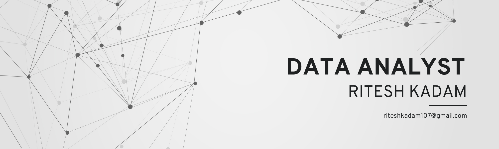

<h1 align="center">Hi 👋, I'm Ritesh Kadam</h1>
<h3 align="center">Turning Raw Data into Real Decisions</h3>

  

  

- 🌱 I’m currently learning **Data Science**

- 💬 Ask me about **Python, SQL, MYSQL, Advance Excel, Power BI, Tableau, Data Analysis And Data Visualization**

- 📫 How to reach me **riteshkadam107@gmail.com**

- ⚡ Fun fact **A Data Analyst spends 80% of their time cleaning data and only 20% analyzing it— proving that before you find the gold, you’ve got to wash a lot of dirt! 🧹📊**

- 📝 My Portfolio [https://www.datascienceportfol.io/kadamritesh107](https://www.datascienceportfol.io/kadamritesh107)

- 👨‍💻 All of my projects are available at [https://github.com/Madmax107](https://github.com/Madmax107)

<h3 align="left">Connect with me:</h3>

<h3 align="left">Languages and Tools:</h3>

              

&nbsp;

